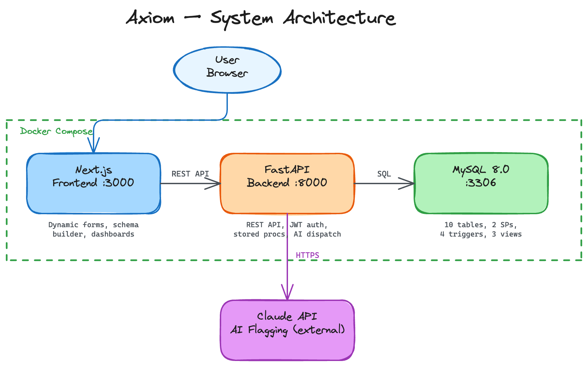
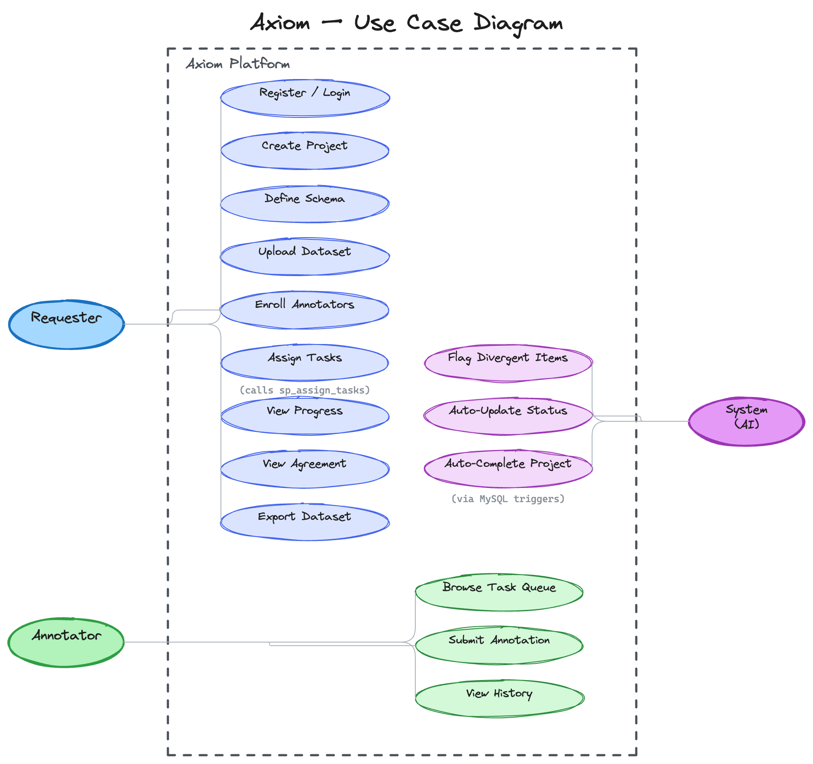

# Axiom

A general-purpose human annotation platform built for collaborative data labeling. Requesters create projects with fully custom schemas, upload datasets, and enroll annotators. Annotators work through items sequentially within each project, submitting structured labels through a dynamic form renderer. An AI flagging system (Claude API) identifies items where annotators diverge.


## Architecture



## Use Cases



## Stack

| Layer       | Technology                                           |
| ----------- | ---------------------------------------------------- |
| Frontend    | Next.js 14, TypeScript, Tailwind CSS 3, lucide-react |
| Backend     | FastAPI, aiomysql, PyJWT, Pydantic                   |
| Database    | MySQL 8.0 (stored procedures, triggers, views)       |
| AI Flagging | Claude API (Anthropic SDK)                           |
| Deployment  | Docker Compose (3 containers)                        |

## Design

Dark glassmorphism UI with pixel art accents. Custom `--ax-*` CSS variable system alongside shadcn-compatible HSL tokens.

- **Fonts**: DM Sans, JetBrains Mono, Instrument Serif
- **Accent**: Electric cyan `#00d4ff`
- **Auth pages**: Easemize split-panel layout with glass inputs and staggered animations
- **Dashboard**: CRM-style Kanban pipeline, pixel art stat card icons, SVG progress ring
- **Annotator flow**: Sequential annotation within projects with auto-advance on submit
- **Assets**: Programmatically generated pixel art (Pillow) for icons, empty states, hero scenes

## Getting Started

### Prerequisites

- Docker & Docker Compose
- (Optional) [Colima](https://github.com/abiosoft/colima) on macOS as Docker runtime

### Run

```bash
docker-compose up --build
```

| Service     | URL                   |
| ----------- | --------------------- |
| Frontend    | http://localhost:3000 |
| Backend API | http://localhost:8000 |
| MySQL       | localhost:3306        |

### Environment Variables

Create a `.env` file in the project root:

```env
CLAUDE_API_KEY=sk-ant-...    # optional, for AI flagging
```

Default credentials (configured in `docker-compose.yml`):

| Variable                    | Default                         |
| --------------------------- | ------------------------------- |
| MYSQL_ROOT_PASSWORD         | axiom_root                      |
| MYSQL_USER / MYSQL_PASSWORD | axiom_user / axiom_pass         |
| JWT_SECRET                  | axiom-dev-secret-change-in-prod |

### Demo Accounts

Pre-seeded after running the seed script:

| Email          | Password    | Role      |
| -------------- | ----------- | --------- |
| demo@axiom.dev | password123 | Requester |
| ann1@axiom.dev | password123 | Annotator |
| ann2@axiom.dev | password123 | Annotator |
| ann3@axiom.dev | password123 | Annotator |

## Roles

| Role          | Capabilities                                                                                                                                                      |
| ------------- | ----------------------------------------------------------------------------------------------------------------------------------------------------------------- |
| **Requester** | Create projects, define annotation schemas, upload JSON datasets, enroll annotators, assign tasks, view agreement scores, AI-flag divergent items, export results |
| **Annotator** | View project-grouped task queue, annotate items sequentially within a project, track progress, view submission history                                            |

## Features

- **Custom Schema Builder** — define annotation fields per project (Likert scales, boolean, free text, multi-select)
- **Dynamic Annotation Form** — renders at runtime from JSON schema definitions
- **Sequential Annotation Flow** — annotators work through items one-by-one within a project, with progress tracking and auto-advance
- **Image Support** — item data with image URLs renders inline images in the annotation view
- **Round-Robin Task Assignment** — stored procedure distributes items across enrolled annotators, respecting `min_annotations_per_item`
- **Automatic Status Transitions** — triggers mark tasks as submitted and auto-complete projects when all tasks are done
- **Inter-Annotator Agreement** — stored procedure computes % agreement per field
- **AI Flagging** — Claude API analyzes items where annotators diverge, provides rationale
- **JSON Export** — flattened export of all annotations with flags

## Database

The MySQL schema includes:

**12 tables:** `users`, `projects`, `schema_fields`, `datasets`, `dataset_items`, `project_annotators`, `annotation_tasks`, `annotations`, `ai_flags`, `agreement_scores`, `export_log`

**2 stored procedures:**

- `sp_assign_tasks` — round-robin task distribution
- `sp_compute_agreement` — per-field agreement calculation

**4 triggers:**

- Auto-mark task as submitted on annotation insert
- Auto-complete project when all tasks are submitted
- Prevent schema edits on non-draft projects (insert + update)

**3 views:**

- `v_project_progress` — dashboard progress stats
- `v_annotator_workload` — per-annotator task counts
- `v_annotation_export` — flattened export join

## API

```
POST   /api/auth/register
POST   /api/auth/login
GET    /api/auth/me

GET/POST       /api/projects
GET/PATCH      /api/projects/{id}
GET            /api/projects/{id}/progress

GET/POST       /api/projects/{id}/schema
PUT/DEL        /api/projects/{id}/schema/{fid}

GET/POST       /api/projects/{id}/datasets
POST           /api/projects/{id}/datasets/{did}/upload
GET            /api/projects/{id}/datasets/{did}/items

GET/POST/DEL   /api/projects/{id}/annotators
POST           /api/projects/{id}/annotators/assign

GET            /api/tasks
GET            /api/tasks/projects                       # grouped by project
GET            /api/tasks/projects/{pid}/next             # next item in project
GET            /api/tasks/history/projects                # history by project
GET            /api/tasks/{tid}
PATCH          /api/tasks/{tid}/start
POST           /api/tasks/{tid}/submit

GET            /api/projects/{id}/agreement
POST           /api/projects/{id}/agreement/compute
GET            /api/projects/{id}/flags
POST           /api/projects/{id}/flags/analyze

GET            /api/projects/{id}/export?format=json
```

## Project Structure

```
mas/
├── docker-compose.yml
├── .env
├── backend/
│   ├── Dockerfile
│   ├── requirements.txt
│   └── app/
│       ├── main.py                 # FastAPI app + CORS
│       ├── config.py               # Pydantic settings
│       ├── database.py             # aiomysql connection pool
│       ├── auth.py                 # JWT + bcrypt utilities
│       ├── db/
│       │   ├── schema.sql          # Full DDL (tables, triggers, views)
│       │   └── procedures.sql      # Stored procedures
│       ├── routers/
│       │   ├── auth.py             # Register, login, me
│       │   ├── projects.py         # Project CRUD + progress
│       │   ├── schema.py           # Annotation field definitions
│       │   ├── datasets.py         # Dataset + JSON item upload
│       │   ├── annotators.py       # Enroll, remove, assign tasks
│       │   ├── tasks.py            # Task queue, sequential flow, submit
│       │   ├── agreement.py        # Agreement scores + flags
│       │   └── export.py           # JSON export
│       └── services/
│           └── ai_flagging.py      # Claude API integration
├── frontend/
│   ├── Dockerfile
│   ├── package.json
│   ├── tailwind.config.ts
│   ├── public/
│   │   └── pixels/                 # Generated pixel art assets
│   └── src/
│       ├── app/
│       │   ├── globals.css         # Design system (--ax-* vars)
│       │   ├── layout.tsx          # Root layout + AuthProvider
│       │   ├── page.tsx            # Role-based redirect
│       │   ├── login/page.tsx      # Easemize sign-in
│       │   ├── register/page.tsx   # Split-panel registration
│       │   ├── dashboard/page.tsx  # CRM-style dashboard
│       │   ├── projects/
│       │   │   ├── new/page.tsx    # Create project
│       │   │   └── [id]/page.tsx   # Project detail (5 tabs)
│       │   └── annotate/
│       │       ├── page.tsx              # Project-grouped queue
│       │       ├── project/
│       │       │   └── [projectId]/page.tsx  # Sequential annotation
│       │       ├── [taskId]/page.tsx     # Read-only submitted view
│       │       └── history/page.tsx      # History by project
│       ├── components/
│       │   ├── DynamicAnnotationForm.tsx  # Schema-driven form renderer
│       │   ├── ItemDataRenderer.tsx       # Auto image/URL/text detection
│       │   ├── NavWrapper.tsx             # Conditional navbar hide
│       │   └── ui/
│       │       └── sign-in.tsx           # Easemize auth component
│       └── lib/
│           ├── api.ts              # Fetch wrapper with JWT auth
│           └── auth.tsx            # AuthContext + token storage
└── docs/
    ├── GUIDE.md                    # Detailed implementation guide
    ├── er-diagram.excalidraw
    ├── system-architecture.excalidraw
    └── use-case-diagram.excalidraw
```

## License

MIT
